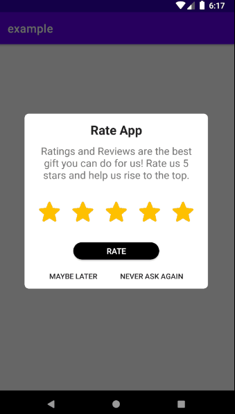

# Rating-Dialog-Library

## Latest Version
[](https://jitpack.io/#mpountou/Rating-Dialog-Library)

## Description

A material designed app Rating Dialog for Android 

## Features
- Show dialog on a specific session
- Ask user rate your app
- Don't show dialog again if option never ask again or rate are clicked
- Set custom title / description 
- Set custom text for possitive neutral or negative buttons

## Installation

Add jitpack in your root build.gradle at the end of repositories:
```
	allprojects {
		repositories {
			...
			maven { url 'https://jitpack.io' }
		}
```

Add the dependency
```
	dependencies {
	
	         implementation 'com.github.mpountou:Rating-Dialog-Library:0.0.1'
	}
```

## How to use


```
var dialogManager = DialogManager(this)
// you can use your custom title or let the default
dialogManager.setDialogTitle("Rate My App!!")
// same for description and buttons .. 
dialogManager.show()
  ```
